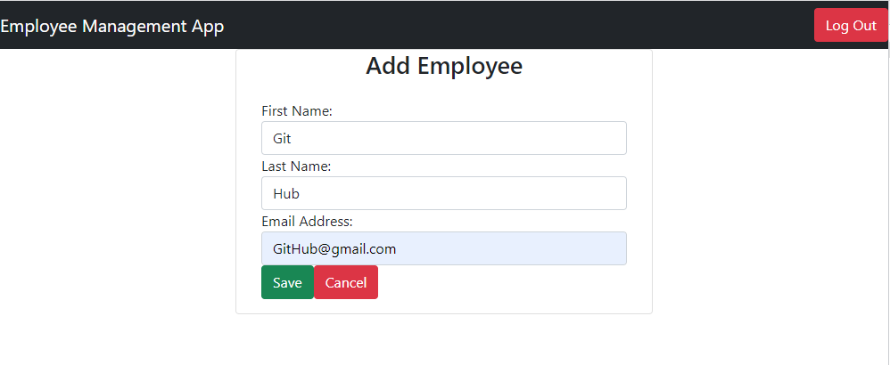
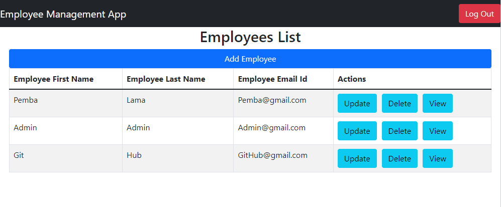

# Employee-Management-App
Full Stack Application with React and Spring Boot

### Features

- Add Employees information
- Save Employee information
- Delete Employee information
- Update Employee information
- Login Authentication

https://user-images.githubusercontent.com/30161586/149484437-045e8c12-a443-40c7-b123-20315da38488.mp4

### Technologies

- React (Frontend View Framework), React Create App(To create React project)
- Spring Boot (REST API Framework), Spring (Dependency Management)
- MySQL Database
- Various JavaScript Libraries (Axios, React Router)
- BootStrap (Styling Pages)
- Maven (dependencies management)
- Node (npm)
- Visual Studio Code (JavaScript IDE)
- Eclipse (Java IDE)
- Tomcat Embedded Web Server

